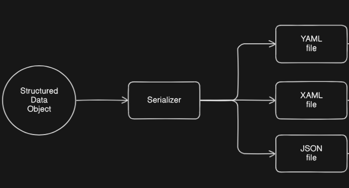
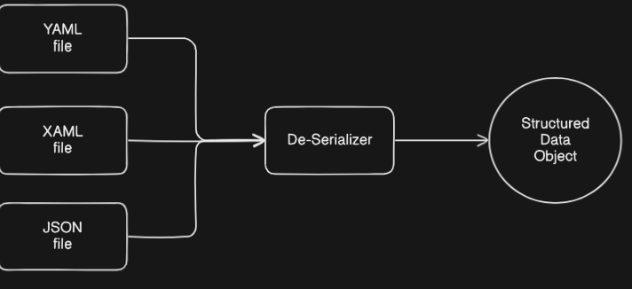
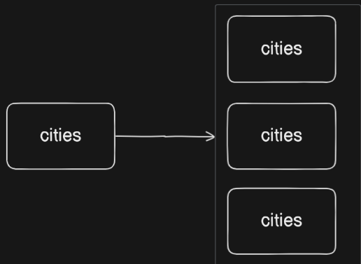

## YAML

- YAML stands for ***"YAML Ain't Markup Language"***. Initially, it stood for ***"Yet Another Markup Language"***

- Note: ***".yaml"*** and ***".yml"*** files are same.

- Data format used to exchange data

- Similar to XAML & JSON

- In YAML, you can store only data, and not command.

---
### Data Serializaztion

Data serialization is the process of converting structured data into a format that can be easily stored or transmitted and then reconstructed later. Serialization formats are often used for data exchange between systems or for saving configurations.

#### Key Aspects of Data Serialization:
- **Conversion**: Transforms data into a byte stream or a human-readable format.
- **Transport**: Serialized data can be transmitted over networks or stored in files.
- **Deserialization**: Converts the serialized format back into its original data structure.

#### Common Data Serialization Formats:
1. YAML: Human-readable, commonly used for ***configuration files***.
2. JSON (JavaScript Object Notation): Lightweight and widely used for APIs and data exchange.
3. XML (eXtensible Markup Language): Flexible but more verbose.
4. Protobuf (Protocol Buffers): Efficient binary serialization format developed by Google.
5. MessagePack: Binary serialization format optimized for speed and size.

<br/>





---

YAML (Ain't Markup Language) files are widely used due to their simplicity and flexibility. Here are the **key benefits of using YAML files**:

---
### Benefits

#### 1. **Human-Readable and Intuitive**
   - YAML uses a clean, indentation-based structure that is easy to read and understand.
   - It's more concise and readable compared to alternatives like XML or JSON.

---

#### 2. **Supports Complex Data Structures**
   - YAML can represent hierarchical and complex data structures, including:
     - Lists
     - Dictionaries (key-value pairs)
     - Nested elements
   - Example:
     ```yaml
     person:
       name: John
       age: 30
       hobbies:
         - Reading
         - Cycling
     ```

---

#### 3. **Lightweight Syntax**
   - YAML avoids unnecessary syntax like brackets or quotes unless needed.
   - It uses indentation for hierarchy, reducing clutter.

---

#### 4. **Cross-Language Support**
   - YAML is supported by multiple programming languages, making it versatile for configuration and data exchange.

---

#### 5. **Ease of Configuration**
   - YAML is extensively used for configuration files in tools and frameworks like:
     - Kubernetes
     - Docker Compose
     - Ansible
     - Spring Boot

---

#### 6. **Comment Support**
   - YAML allows comments using `#`, making it easier to document configurations.
   - Example:
     ```yaml
     # This is a sample YAML file
     app:
       name: MyApplication
       version: 1.0
     ```

---

#### 7. **Extensibility**
   - YAML supports anchors and references, enabling reuse of repeated values.
   - Example:
     ```yaml
     defaults: &default_settings
       timeout: 30
       retries: 3

     server1:
       <<: *default_settings
       host: server1.example.com
     ```

---


### Indentation in YAML

**Indentation** is crucial in YAML as it defines the structure and hierarchy of data. Unlike some formats (e.g., JSON), YAML relies on indentation instead of braces or brackets to represent nested elements. Proper indentation is mandatory in YAML for correct parsing.

---

#### **Rules of Indentation in YAML**
1. **Spaces Only, No Tabs**
   - YAML strictly uses spaces for indentation. Tabs are **not allowed** and will result in a parsing error.
   - Example (correct):
     ```yaml
     key1:
       key2: value
     ```
   - Example (incorrect - uses tabs):
     ```yaml
     key1:
     \tkey2: value
     ```

2. **Consistent Indentation**
   - The number of spaces used for each indentation level must be consistent throughout the file.
   - Example:
     ```yaml
     app:
       name: MyApp
       version: 1.0
     ```

3. **Recommended Number of Spaces**
   - There is no strict requirement for how many spaces to use, but 2 or 4 spaces are common conventions.

---

#### **How Indentation Defines Hierarchy**
YAML uses indentation to indicate the parent-child relationship between keys and values.

##### Example:
```yaml
person:
  name: John
  details:
    age: 30
    hobbies:
      - Reading
      - Cycling
```
**Explanation:**
- `person` is the parent key.
- `name` and `details` are children of `person`.
- `age` and `hobbies` are nested under `details`.
- The list under `hobbies` is further indented.

---

#### **Common Errors with Indentation**
1. **Mixing Tabs and Spaces**
   - YAML does not allow mixing tabs and spaces. This will cause an error.
   - Example (incorrect):
     ```yaml
     key1:
     	key2: value  # Uses a tab
     ```

2. **Inconsistent Indentation Levels**
   - Using a different number of spaces for indentation will result in a parsing error.
   - Example (incorrect):
     ```yaml
     app:
       name: MyApp
        version: 1.0  # Extra space here
     ```

---

#### **Indentation in Multi-Line Strings**
YAML allows multi-line strings where indentation is used to indicate continuation.

##### Example:
```yaml
description: >
  This is a multi-line
  string in YAML.
  It continues until the indentation stops.
```

---

#### Note : Check if your .yaml file is valid or not in [yaml lint](https://www.yamllint.com/)

---

### Some Examples

##### Example
```yaml
# Key value pairs
"apple" : "I am a red Fruit"
42 : "My Roll number"

--- # seperates documents

# Lists
- apple
- Apple #yaml is case sensitive hence apple & Apple is different
- mango
- banana

---

# block style
cities:
 - new Delhi
 - mumbai
 - nashik

... # end of document
```

Your YAML snippet demonstrates some important features, including **key-value pairs**, **lists**, and document separators. Let’s break it down:

---

#### **Key-Value Pairs**
- YAML uses `:` to define a **key-value pair**.
- Keys can be strings or numbers.
- Example:
  ```yaml
  "apple" : "I am a red Fruit"  # String key and value
  42 : "My Roll number"         # Numeric key with string value
  ```
  **Note:**
  - Strings in quotes (`"apple"`) or unquoted (e.g., `apple`) are allowed.
  - Quoting is useful when keys or values contain special characters or spaces.

---

#### **Document Separators**
- `---` separates multiple YAML documents in a single file.
- `...` indicates the end of a document (optional but can be used for clarity).
- Example:
  ```yaml
  ---
  - apple
  - mango
  ...
  ```

---

#### **Lists**
- Lists are created using `-` (dash) followed by a space.
- YAML is **case-sensitive**, so items like `apple` and `Apple` are treated as different.
- Example:
  ```yaml
  - apple
  - Apple  # Different from "apple"
  - mango
  - banana
  ```

---

#### **Block Style**
- YAML supports **block styles** for lists and nested structures.
- Example:
  ```yaml
  cities:
   - new Delhi
   - mumbai
   - nashik
  ```
  Here, `cities` is a key, and its value is a list of cities.

<br/> 



---
